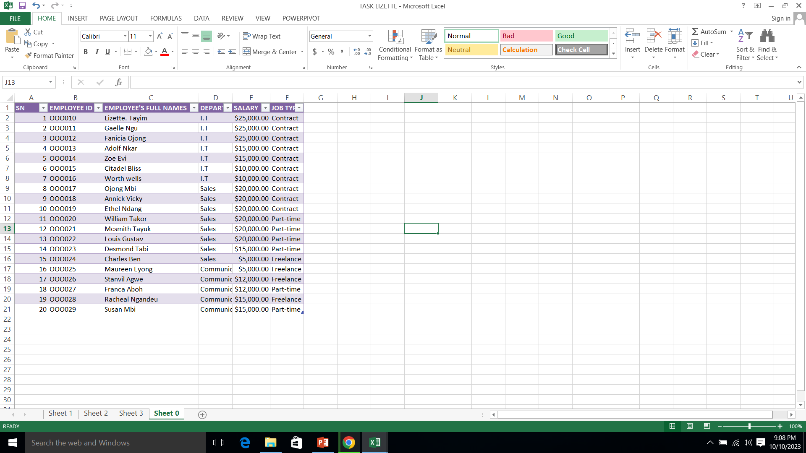
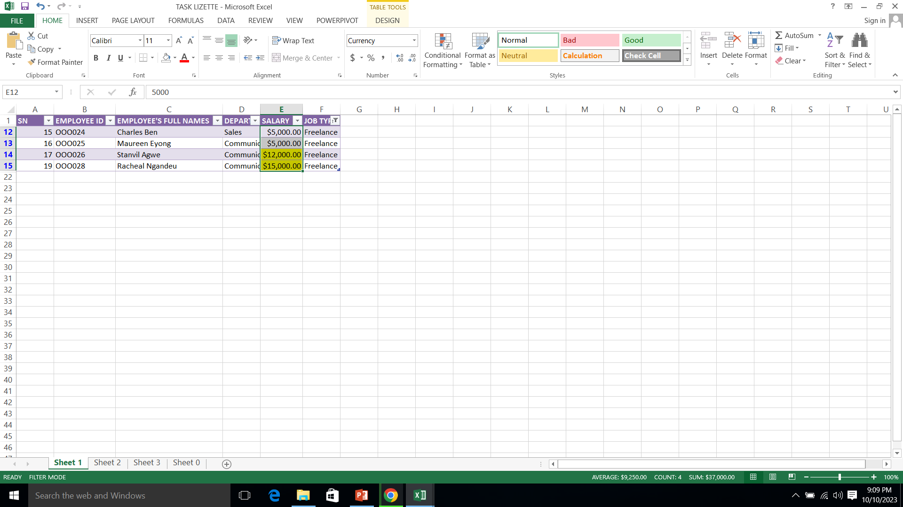
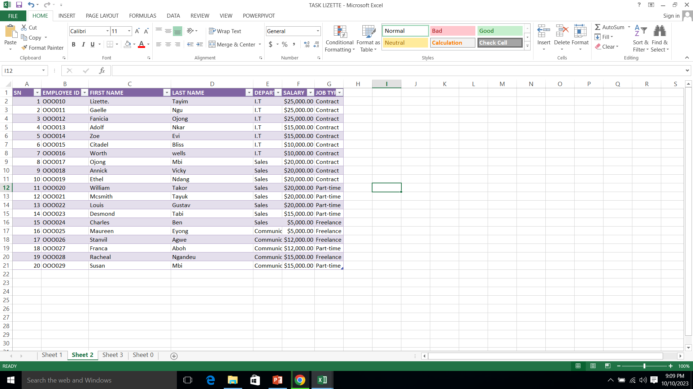
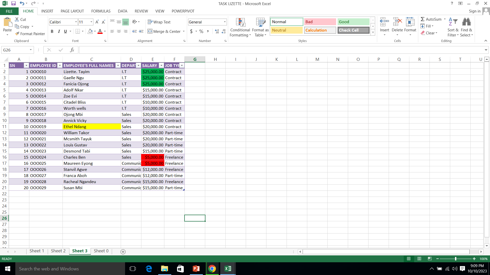

# Data Analysis Training_Task1

## In worksheet0, we were instructed to create a with 20 rows of information with the following fields
-Employee ID,-Employee full names, Departments specifying Communications, IT,Sales, Salary between $5000-$25000 and Jobtype (Contract, Freelance and part-time)

I created the table combining the alpha-numeric keys to form the Employees ID. I use names that i could easily recall as Employees names.while salaries, Departments and jobtype were selected randomly.

## In worksheet1, we were asked to show only employees who are freelancers and highlight the ones whose salaries are above $10000
On the menu bar, i clicked on the Home menu and then go to Sort and filter, chose jobtype to filter all employees who are frelancers. As for their salaries, i clicked on conditional formatting and then select the rule greater than to highlight the employees whose salaries are greater than $10000

## The task in worksheet2 is to split the Employees full names into first name and last name and to also check for duplicates if any.
While working on this, i inserted a new column beside the Employees name.i went to the Data menu and selected Text to column, where a dialog box was displayed on the screen asking me to select the file that best describes my data. I selected delimited and a preview of the selected data was displayed. I later on cllicked on Next, the delimiters appeared and i chose space. Took next again, and then select column datas as in general then click finish. No duplicate was recorded.

## In worksheet 3 we were expected to, highlight employees whose names begin with the letter ‘E’ (in yellow). Format the Salary column such that the highest SALARY has a green background and the lowest SALARY has a red background.
on the worksheet, i clicked on conditional formatting, selected new rule, select the rule type then clicked on format cells that contain a specific text. Afterwhich, i chose beginning with E then chose the colour and clicked entered. My cell was highlighted.Use conditional formatting to highlight the highest and lowest salary with Green and red bacground respectively.

